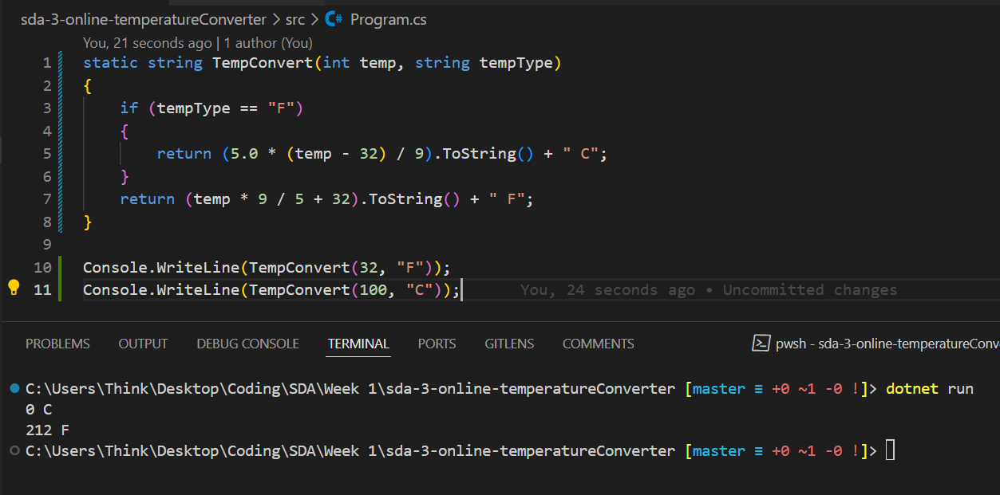
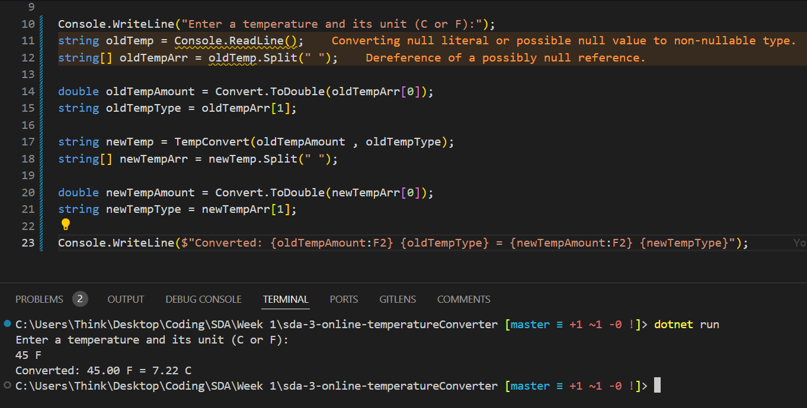

# Temperature Converter

Develop a temperature converter program in C# that converts temperature values between Fahrenheit and Celsius.

## Level 1: Basic conversion

Implements a TempConvert function to perform temperature conversions.

- Function TempConvert should receive 2 parameters: the amount of temperature, and the original measurement unit
- Function TempConvert should return the string, containing new temperature and new unit.

```
// Expected output
TempConvert(32, "F") returns "0 C"
TempConvert(100, "C") returns "212 F"
```

## Level 2: Additional requirement: Asking for user input

- Modify the application to prompt the user for a temperature value and a scale (Celsius 'C' or Fahrenheit 'F').

```
// Expected output
Enter a temperature and its unit (C or F):
> 45 F
Converted: 45 F = 7.22 C

```

### Level 3: Advanced requirement: Continuous interaction

- Implement comprehensive error handling for invalid inputs (non-numeric values, unsupported scales).
- Modify the program to continuously prompt the user for input until the user enters `Quit.

```
// Expected output
Enter a temperature and its unit (C or F), or type 'Quit' to exit:
> 30 X
Invalid scale. Please enter 'C' for Celsius or 'F' for Fahrenheit.

Enter a temperature and its unit (C or F), or type 'Quit' to exit:
> forty-five C
Invalid input. Please enter a numeric temperature.

Enter a temperature and its unit (C or F), or type 'Quit' to exit:
> 45 C
Converted: 45 C = 113 F

Enter a temperature and its unit (C or F), or type 'Quit' to exit:
> Quit
Program terminated.

```

## Screenshots of your output
Part 1


Part 2


## **DEADLINE: 9am Tuesday 27.8**
